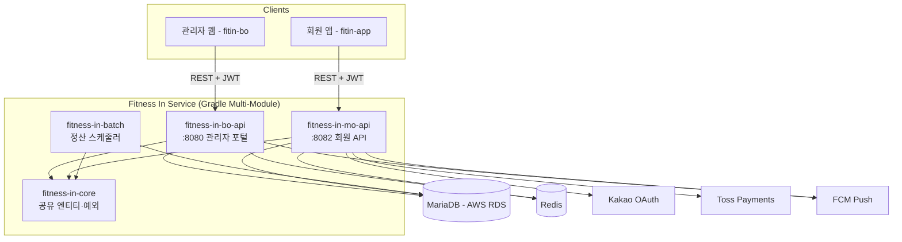

# Fitness In Service — 헬스장 통합 관리 플랫폼

> 센터·트레이너·회원·PT세션·급여·GX클래스·결제를 아우르는 Spring Boot 멀티모듈 백엔드 + 관리자 웹 + 회원 앱
> 서비스: `https://beta.fitness-trainer-assistant.ai.kr` (운영 중)

> **소스코드 비공개 안내**: 실서비스 운영 중인 프로젝트로 소스코드는 비공개이며, 아키텍처·기술 스택·담당 기능을 중심으로 소개합니다.

---

## 개요

- **BO (BackOffice) API** — 센터 운영진이 쓰는 관리자 포털 백엔드
- **MO (Mobile) API** — 회원이 쓰는 앱 백엔드
- **Batch** — 세션 합계 등 주기적 정산 작업
- 관리자 웹(fitin-bo)·회원 앱(fitin-app) 프론트엔드까지 포함한 3-repo 구성

## 기술 스택

| 영역 | 기술 |
|------|------|
| Backend | Java 17, Spring Boot 4.0.0, MyBatis, Spring Batch |
| DB / Cache | MariaDB 10.x (AWS RDS), Redis (Spring Session) |
| 인증 | JWT (JJWT) — Access 1h(BO)/7d(MO), Refresh 14d · Kakao OAuth |
| 결제 / 알림 | Toss Payments(승인·Webhook), FCM 푸시, SSE 실시간 알림 |
| 문서화 | SpringDoc OpenAPI(Swagger) — 엔드포인트 변경 시 API 정의서 자동 갱신 |
| 인프라 | Docker, AWS EC2/RDS, Nginx, Gradle 멀티모듈 |
| Frontend | React, Vite, TypeScript (관리자 웹 / 회원 앱 각각 별도 SPA) |

## 아키텍처

**레이어 구조**: `Controller → Service → Mapper(MyBatis) → Entity(DB)`, 도메인별 `dto/vo/mapper/service/web` 패키지 분리, 모든 응답은 `ApiResponse<T>`로 통일.

## 주요 기능

**BO (관리자)**
- 센터/장비/상품 등록·관리, 트레이너 배정, 상담 이력
- PT 세션 등록·수정·신체기록, 회원권 관리·양도
- 급여 정산 (직급·센터별 기준, 예상/실 급여 계산)
- 대시보드 (월 매출, 트레이너 랭킹, 재등록율)
- GX 클래스 스케줄 관리 및 예약 취소/복구 (알림 연동)
- 직원 실시간 알림 (FCM)

**MO (회원 앱)**
- 이메일/Kakao 로그인, GX 클래스 조회·예약
- 장바구니, 상품 주문, Toss 결제 승인/Webhook
- 마이페이지 (이용권, 예약, 포인트, 쿠폰, 출석), SSE 실시간 알림

**Batch**
- 매시 정각 세션 합계 자동 집계

## 규모

| 저장소 | 역할 | 커밋 수 |
|--------|------|---------|
| Fitness-In-Service | 백엔드 (BO/MO/Batch/Core) | 698 |
| fitin-bo | 관리자 웹 프론트엔드 | 785 |
| fitin-app | 회원 앱 프론트엔드 | 288 |

## AI 활용 — 멀티 에이전트 개발 워크플로우

단순히 Claude Code로 코드를 생성하는 수준이 아니라, 역할별 전문 에이전트 + 축적형 프로젝트 메모리로 개발 프로세스 자체를 구성했습니다.

- **역할 분리형 서브에이전트**: 요구사항 기획(requirement-planner) → 개발(fitness-senior-developer) → QA(qa-test-engineer) → 커밋(git-commit-pusher)로 작업을 분리
- **축적형 프로젝트 메모리**: 결제 도메인, 보안 패턴, API 설계 규칙 등을 `MEMORY.md`/도메인별 문서로 계속 누적 — 매 세션 반복 설명 없이 컨텍스트 유지
- **스킬 기반 라우팅**: 작업 유형(Batch/Redis/SQL/API 문서화 등)별로 필수 참조 문서를 매핑한 마스터 인덱스 운영
- **엄격한 품질 게이트**: 커밋 전 해당 모듈 Gradle 빌드 검증 필수, API 스펙 변경 시 정의서 자동 갱신을 표준 절차로 강제

이 구조 덕분에 1인 개발로 3개 저장소(백엔드 멀티모듈 + 관리자 웹 + 회원 앱), 1,700+ 커밋 규모의 서비스를 설계–개발–운영까지 이어갈 수 있었습니다.

---

*실제 코드는 비공개이나, 아키텍처·설계 결정·트러블슈팅 경험에 대해서는 인터뷰에서 상세히 설명 가능합니다.*
